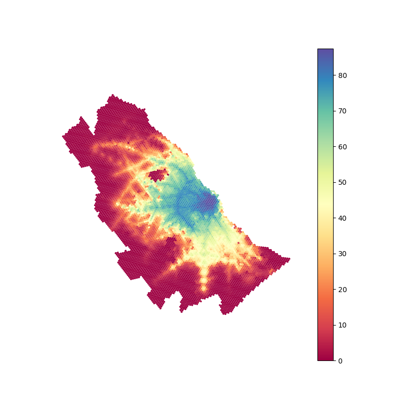

# ba_accessibility
Scripts to conduct job accessibility analysis in Buenos Aires

#### To get started and run the analysis:
```
1. Install python 3.8 
2. Install pip3: sudo apt-get install python3-pip
3. Install virtualenv: sudo apt install virtualenv
4. Clone ba_accessibility repository: git clone https://github.com/urbansim/ba_accessibility.git
5. Navigate to the main directory: cd ba_accessibility
6. Create a clean python 3.8 environment: virtualenv -p python3.8 env
7. Activate the new environment: source env/bin/activate
8. Install repo requirements: pip3.8 install -r ba_accessibility/requirements.txt
9. Navigate to the internal ba_accessibility folder: cd ba_accessibility
10. Execute the run_analysis script passing appropriate parameters
```

#### The parameters of the `run_analysis.py` script are:

• `ud`: Update Demographics flag. Must be passed the first time the script is executed and any time the jobs or population data changes. 

• `ug`: Update GTFS flag. Must be passed the first time the script is executed and any time the input GTFS files change. 

• `p`: List of project ids to process separated by spaces. At least one project id must be passed


#### Example

The example below runs the initial accessibility analysis for project 1 
```
python3.8 run_analysis.py -ud -ug -p 1 
```

#### Outputs
The model exports images in png format with baseline accessibility and accessibility 
change after the project is implemented, for 60 min and 90 min time thresholds. These 
images can be found in the ba_accessibility/ba_accessibility/results/output_maps path, 
together with a reuslts shapefile that can be used for postprocessing

##### Baseline Accessibility, 90 minutes


The model also exports the following results in csv format:

* baseline.csv: accessibility values per hexagonal zone for the baseline scenario
* project_[PROJECT_CODE].csv: accessibility values per hexagonal zone for the scenario with project
* results_all_projects.csv: summary of population weighted accessibility values for the area of influence


#### Hardware Requirements
The complete analysis for two projects runs in about 8 hours in a machine with 32GB of RAM. 


